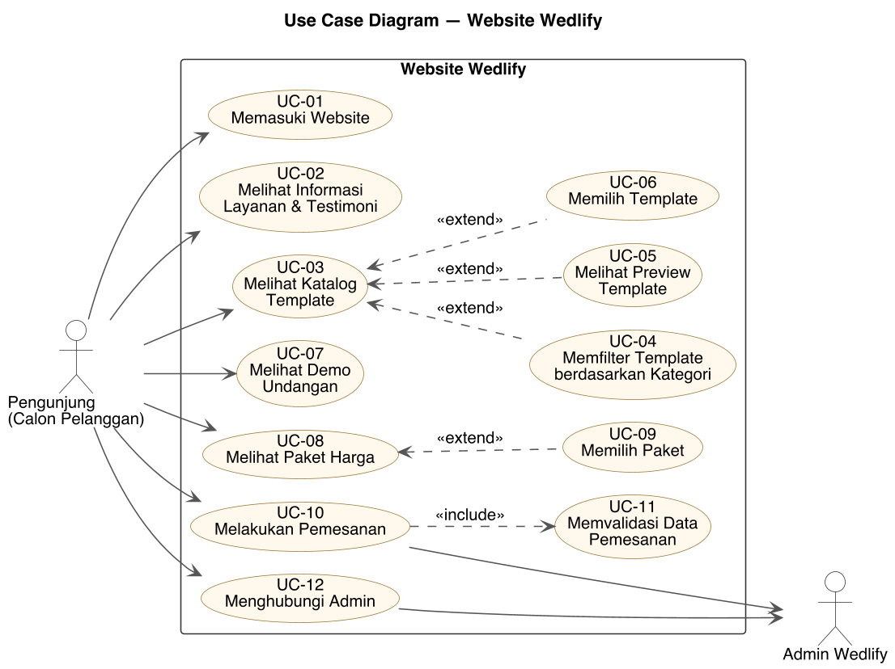

# Spesifikasi Kebutuhan: Use Case Diagram dan Use Case Description

**Aplikasi:** Wedlify, website layanan undangan pernikahan digital dan cetak
**Teknologi:** React, TypeScript, Vite, Tailwind CSS (di-deploy di Vercel)

## 1. Gambaran Umum Sistem

Wedlify adalah website *landing page* untuk memasarkan layanan pembuatan undangan pernikahan digital maupun cetak. Melalui website ini, pengunjung dapat mengenal layanan Wedlify, melihat katalog template undangan, mencoba demo undangan, membandingkan paket harga, lalu melakukan pemesanan. Data pemesanan dikirim ke admin Wedlify melalui WhatsApp.

Batasan sistem:

- Tidak memerlukan login atau registrasi pengguna.
- Tidak memiliki database. Data pemesanan tidak disimpan di server, tetapi diteruskan sebagai pesan WhatsApp ke admin.
- Pemrosesan pesanan (konfirmasi, pembayaran, pembuatan undangan) dilakukan admin di luar sistem.

## 2. Use Case Diagram

Sumber diagram: [`use-case-diagram.puml`](use-case-diagram.puml) (PlantUML).

## 3. Daftar Aktor

| Aktor | Jenis | Deskripsi |
|-------|-------|-----------|
| Pengunjung (Calon Pelanggan) | Primer | Orang yang mengakses website Wedlify untuk mencari informasi layanan undangan pernikahan dan melakukan pemesanan. |
| Admin Wedlify | Sekunder | Pihak Wedlify yang menerima pesanan dan pertanyaan dari pengunjung melalui WhatsApp, Instagram, atau Email. |

## 4. Daftar Use Case

| ID | Nama Use Case | Aktor | Relasi |
|----|---------------|-------|--------|
| UC-01 | Memasuki Website | Pengunjung | – |
| UC-02 | Melihat Informasi Layanan & Testimoni | Pengunjung | – |
| UC-03 | Melihat Katalog Template | Pengunjung | – |
| UC-04 | Memfilter Template berdasarkan Kategori | Pengunjung | `<<extend>>` UC-03 |
| UC-05 | Melihat Preview Template | Pengunjung | `<<extend>>` UC-03 |
| UC-06 | Memilih Template | Pengunjung | `<<extend>>` UC-03 |
| UC-07 | Melihat Demo Undangan | Pengunjung | – |
| UC-08 | Melihat Paket Harga | Pengunjung | – |
| UC-09 | Memilih Paket | Pengunjung | `<<extend>>` UC-08 |
| UC-10 | Melakukan Pemesanan | Pengunjung, Admin Wedlify | `<<include>>` UC-11 |
| UC-11 | Memvalidasi Data Pemesanan | – (dijalankan sistem) | di-*include* oleh UC-10 |
| UC-12 | Menghubungi Admin | Pengunjung, Admin Wedlify | – |

Keterangan relasi:

- **`<<extend>>`**: perilaku tambahan yang bersifat opsional. Contohnya, saat melihat katalog (UC-03), pengunjung *boleh* memfilter, melihat preview, atau memilih template, tetapi tidak wajib.
- **`<<include>>`**: perilaku yang selalu dijalankan. Setiap kali pengunjung melakukan pemesanan (UC-10), sistem *selalu* memvalidasi data (UC-11).

## 5. Use Case Description

### UC-01 Memasuki Website

| Item | Keterangan |
|------|------------|
| Aktor | Pengunjung |
| Deskripsi | Pengunjung membuka website Wedlify dan masuk dari layar sambutan ke halaman utama. |
| Pre-condition | Pengunjung memiliki koneksi internet dan membuka URL website Wedlify. |
| Post-condition | Halaman utama Wedlify tampil lengkap dengan menu navigasi. |

**Alur Utama**

| Aksi Aktor | Reaksi Sistem |
|------------|---------------|
| 1. Pengunjung membuka URL website Wedlify. | 2. Sistem menampilkan layar sambutan berisi logo Wedlify dan tombol "Mulai Sekarang". |
| 3. Pengunjung menekan tombol "Mulai Sekarang". | 4. Sistem menyimpan status "sudah masuk" pada sesi browser. |
| | 5. Sistem menampilkan halaman utama dan menggulir ke bagian Home. |

**Alur Alternatif**

- **1a.** Pengunjung sudah pernah menekan "Mulai Sekarang" pada sesi browser yang sama, atau membuka URL yang langsung menuju bagian tertentu (misalnya `/#pricing`): sistem melewati layar sambutan dan langsung menampilkan halaman utama.

---

### UC-02 Melihat Informasi Layanan & Testimoni

| Item | Keterangan |
|------|------------|
| Aktor | Pengunjung |
| Deskripsi | Pengunjung melihat informasi tentang Wedlify, keunggulan, fitur layanan undangan, dan testimoni pelanggan. |
| Pre-condition | Pengunjung sudah berada di halaman utama (UC-01). |
| Post-condition | Pengunjung memperoleh informasi layanan Wedlify. |

**Alur Utama**

| Aksi Aktor | Reaksi Sistem |
|------------|---------------|
| 1. Pengunjung memilih menu "Tentang", "Layanan", atau "Testimoni" pada navbar, atau menggulir halaman. | 2. Sistem menggulir ke bagian yang dipilih dan menandai menu yang aktif. |
| | 3. Sistem menampilkan informasi: keunggulan Wedlify (mudah digunakan, desain modern, terjangkau, proses cepat), fitur layanan (website undangan, RSVP, musik, Google Maps, galeri foto, mobile friendly), dan testimoni pelanggan. |

**Alur Alternatif**

- **1a.** Pengunjung mengakses melalui perangkat mobile: pengunjung menekan ikon menu, lalu sistem menampilkan menu navigasi mobile. Alur dilanjutkan ke langkah 1.

---

### UC-03 Melihat Katalog Template

| Item | Keterangan |
|------|------------|
| Aktor | Pengunjung |
| Deskripsi | Pengunjung melihat daftar template/tema undangan yang tersedia. |
| Pre-condition | Pengunjung sudah berada di halaman utama (UC-01). |
| Post-condition | Daftar template undangan tampil. |

**Alur Utama**

| Aksi Aktor | Reaksi Sistem |
|------------|---------------|
| 1. Pengunjung memilih menu "Katalog" atau menggulir ke bagian katalog. | 2. Sistem menampilkan 12 template undangan, masing-masing berisi gambar, nama tema, kategori, dan deskripsi singkat. |
| | 3. Sistem menampilkan tombol "Preview" dan "Pilih Tema" pada setiap template. |

**Titik Extend**

- Pengunjung dapat memfilter template (UC-04), melihat preview (UC-05), atau memilih template (UC-06).

---

### UC-04 Memfilter Template berdasarkan Kategori

| Item | Keterangan |
|------|------------|
| Aktor | Pengunjung |
| Deskripsi | Pengunjung menyaring template berdasarkan kategori gaya. |
| Pre-condition | Pengunjung sedang melihat katalog template (UC-03). |
| Post-condition | Hanya template sesuai kategori yang dipilih yang ditampilkan. |

**Alur Utama**

| Aksi Aktor | Reaksi Sistem |
|------------|---------------|
| 1. Pengunjung menekan salah satu tombol kategori: Semua, Elegant, Floral, Modern, Traditional, atau Premium. | 2. Sistem menandai kategori yang aktif. |
| | 3. Sistem menampilkan hanya template yang memiliki kategori tersebut. |

**Alur Alternatif**

- **1a.** Pengunjung memilih "Semua": sistem menampilkan kembali seluruh template.

---

### UC-05 Melihat Preview Template

| Item | Keterangan |
|------|------------|
| Aktor | Pengunjung |
| Deskripsi | Pengunjung melihat detail sebuah template dalam jendela preview (modal). |
| Pre-condition | Pengunjung sedang melihat katalog template (UC-03). |
| Post-condition | Detail template tampil pada jendela preview. |

**Alur Utama**

| Aksi Aktor | Reaksi Sistem |
|------------|---------------|
| 1. Pengunjung menekan tombol "Preview" pada salah satu template. | 2. Sistem menampilkan jendela preview berisi gambar besar, nama, kategori, deskripsi template, dan daftar fitur yang termasuk (cover, countdown, detail akad & resepsi, galeri, RSVP, love story, maps, musik). |
| 3. Pengunjung menutup preview dengan tombol tutup, klik di luar jendela, atau tombol Escape. | 4. Sistem menutup jendela preview dan kembali ke katalog. |

**Alur Alternatif**

- **3a.** Pengunjung menekan "Pilih Tema Ini" di dalam preview: alur dilanjutkan ke UC-06.

---

### UC-06 Memilih Template

| Item | Keterangan |
|------|------------|
| Aktor | Pengunjung |
| Deskripsi | Pengunjung memilih template yang diinginkan untuk dipesan. |
| Pre-condition | Pengunjung sedang melihat katalog (UC-03) atau preview template (UC-05). |
| Post-condition | Nama template terisi otomatis pada kolom "Tema Undangan yang Dipilih" di form pemesanan. |

**Alur Utama**

| Aksi Aktor | Reaksi Sistem |
|------------|---------------|
| 1. Pengunjung menekan tombol "Pilih Tema" pada kartu template atau "Pilih Tema Ini" pada preview. | 2. Sistem menutup preview (jika terbuka). |
| | 3. Sistem mengisi kolom "Tema Undangan yang Dipilih" pada form pemesanan dengan nama template. |
| | 4. Sistem menggulir halaman ke form pemesanan. |

---

### UC-07 Melihat Demo Undangan

| Item | Keterangan |
|------|------------|
| Aktor | Pengunjung |
| Deskripsi | Pengunjung mencoba contoh undangan digital yang sudah jadi. |
| Pre-condition | Pengunjung sudah berada di halaman utama (UC-01). |
| Post-condition | Pengunjung dapat melihat dan berinteraksi dengan contoh undangan digital. |

**Alur Utama**

| Aksi Aktor | Reaksi Sistem |
|------------|---------------|
| 1. Pengunjung memilih menu "Demo" atau menggulir ke bagian demo. | 2. Sistem menampilkan contoh undangan digital di dalam bingkai berbentuk ponsel. |
| 3. Pengunjung menggulir dan berinteraksi dengan undangan di dalam bingkai. | 4. Sistem menampilkan isi undangan demo. |

**Alur Alternatif**

- **1a.** Pengunjung menekan "Buka Undangan Digital Langsung": sistem membuka undangan demo di tab baru.
- **2a.** Demo gagal dimuat di dalam bingkai: sistem menampilkan tombol "Buka Demo" untuk membuka undangan demo di tab baru.

---

### UC-08 Melihat Paket Harga

| Item | Keterangan |
|------|------------|
| Aktor | Pengunjung |
| Deskripsi | Pengunjung melihat dan membandingkan paket harga layanan. |
| Pre-condition | Pengunjung sudah berada di halaman utama (UC-01). |
| Post-condition | Daftar paket harga tampil. |

**Alur Utama**

| Aksi Aktor | Reaksi Sistem |
|------------|---------------|
| 1. Pengunjung memilih menu "Harga" atau menggulir ke bagian harga. | 2. Sistem menampilkan 3 paket beserta harga dan fiturnya: **Basic** (Rp150rb), **Standard** (Rp300rb), dan **Premium** (Rp500rb). |

**Titik Extend**

- Pengunjung dapat memilih paket (UC-09).

---

### UC-09 Memilih Paket

| Item | Keterangan |
|------|------------|
| Aktor | Pengunjung |
| Deskripsi | Pengunjung memilih paket yang diinginkan untuk dipesan. |
| Pre-condition | Pengunjung sedang melihat paket harga (UC-08). |
| Post-condition | Nama paket terisi otomatis pada kolom "Paket yang Dipilih" di form pemesanan. |

**Alur Utama**

| Aksi Aktor | Reaksi Sistem |
|------------|---------------|
| 1. Pengunjung menekan tombol "Pilih Basic", "Pilih Standard", atau "Pilih Premium". | 2. Sistem menandai paket yang dipilih. |
| | 3. Sistem mengisi kolom "Paket yang Dipilih" pada form pemesanan. |
| | 4. Sistem menggulir halaman ke form pemesanan. |

---

### UC-10 Melakukan Pemesanan

| Item | Keterangan |
|------|------------|
| Aktor | Pengunjung (primer), Admin Wedlify (sekunder) |
| Deskripsi | Pengunjung mengisi form pemesanan undangan, lalu sistem meneruskan detail pesanan ke WhatsApp admin Wedlify. |
| Pre-condition | Pengunjung sudah berada di halaman utama (UC-01). Perangkat pengunjung dapat membuka WhatsApp (aplikasi atau WhatsApp Web). |
| Post-condition | Pesan WhatsApp berisi detail pesanan siap dikirim ke admin Wedlify, dan form dikosongkan kembali. |

**Alur Utama**

| Aksi Aktor | Reaksi Sistem |
|------------|---------------|
| 1. Pengunjung menekan "Pesan Sekarang" atau menggulir ke bagian form pemesanan. | 2. Sistem menampilkan form pemesanan. |
| 3. Pengunjung mengisi Nama Pengantin Wanita, Nama Pengantin Pria, Tanggal Pernikahan, dan Lokasi. | |
| 4. Pengunjung (opsional) mengisi Tema Undangan, Paket, Referensi Desain/Catatan Tema, dan Pesan Kustom. | |
| 5. Pengunjung menekan tombol "Pesan via WhatsApp". | 6. Sistem memvalidasi data (**include UC-11**). |
| | 7. Sistem menyusun pesan berisi seluruh detail pesanan. Kolom tema/paket yang kosong ditulis "Belum ditentukan". |
| | 8. Sistem membuka WhatsApp di tab baru ke nomor admin Wedlify dengan pesan yang sudah terisi. |
| | 9. Sistem mengosongkan form (tema dan paket yang sudah dipilih tetap dipertahankan). |
| 10. Pengunjung mengirim pesan di WhatsApp. | 11. Admin Wedlify menerima detail pesanan. |

**Alur Alternatif**

- **3a.** Pengunjung sebelumnya sudah memilih template (UC-06) dan/atau paket (UC-09): kolom Tema dan Paket sudah terisi otomatis.
- **6a.** Data tidak valid: sistem menampilkan pesan kesalahan di bawah kolom yang salah dan tidak membuka WhatsApp. Pengunjung memperbaiki data lalu kembali ke langkah 5.

---

### UC-11 Memvalidasi Data Pemesanan

| Item | Keterangan |
|------|------------|
| Aktor | – (dijalankan otomatis oleh sistem sebagai bagian dari UC-10) |
| Deskripsi | Sistem memeriksa kelengkapan dan kebenaran data pada form pemesanan sebelum pesanan diteruskan. |
| Pre-condition | Pengunjung menekan tombol "Pesan via WhatsApp" (UC-10). |
| Post-condition | Data dinyatakan valid (lanjut ke pengiriman) atau tidak valid (pesan kesalahan tampil). |

**Aturan Validasi**

| Kolom | Aturan | Pesan Kesalahan |
|-------|--------|-----------------|
| Nama Pengantin Wanita | Wajib, minimal 2 karakter | "Nama pengantin wanita wajib diisi" |
| Nama Pengantin Pria | Wajib, minimal 2 karakter | "Nama pengantin pria wajib diisi" |
| Tanggal Pernikahan | Wajib diisi | "Tanggal pernikahan wajib diisi" |
| Lokasi | Wajib, minimal 5 karakter | "Lokasi wajib diisi" |
| Tema, Paket, Catatan Tema, Pesan Kustom | Opsional | – |

**Alur Utama**

| Aksi Aktor | Reaksi Sistem |
|------------|---------------|
| | 1. Sistem memeriksa setiap kolom sesuai aturan validasi. |
| | 2. Semua kolom valid: sistem mengembalikan hasil "valid" ke UC-10. |

**Alur Alternatif**

- **2a.** Ada kolom yang tidak valid: sistem menampilkan pesan kesalahan berwarna merah di bawah kolom tersebut dan menghentikan proses pemesanan.

---

### UC-12 Menghubungi Admin

| Item | Keterangan |
|------|------------|
| Aktor | Pengunjung (primer), Admin Wedlify (sekunder) |
| Deskripsi | Pengunjung menghubungi admin Wedlify untuk bertanya melalui WhatsApp, Instagram, atau Email. |
| Pre-condition | Pengunjung sudah berada di halaman utama (UC-01). |
| Post-condition | Aplikasi/halaman kontak yang dipilih terbuka dan pengunjung dapat berkomunikasi dengan admin. |

**Alur Utama**

| Aksi Aktor | Reaksi Sistem |
|------------|---------------|
| 1. Pengunjung memilih menu "Contact" atau menggulir ke bagian kontak. | 2. Sistem menampilkan pilihan kontak: Instagram, WhatsApp, dan Email. |
| 3. Pengunjung memilih salah satu kontak. | 4. Sistem membuka kontak yang dipilih: WhatsApp dengan pesan sapaan otomatis, profil Instagram @wedlify.id, atau aplikasi email ke wedlify@gmail.com. |
| 5. Pengunjung mengirim pertanyaan. | 6. Admin Wedlify menerima pertanyaan. |

**Alur Alternatif**

- **1a.** Pengunjung menekan tombol WhatsApp melayang di pojok layar: sistem langsung membuka WhatsApp admin dengan pesan sapaan otomatis. Alur dilanjutkan ke langkah 5.
- **1b.** Pengunjung memilih ikon kontak (Instagram, WhatsApp, Email) pada navbar, atau ikon Instagram pada footer: alur dilanjutkan ke langkah 4.
